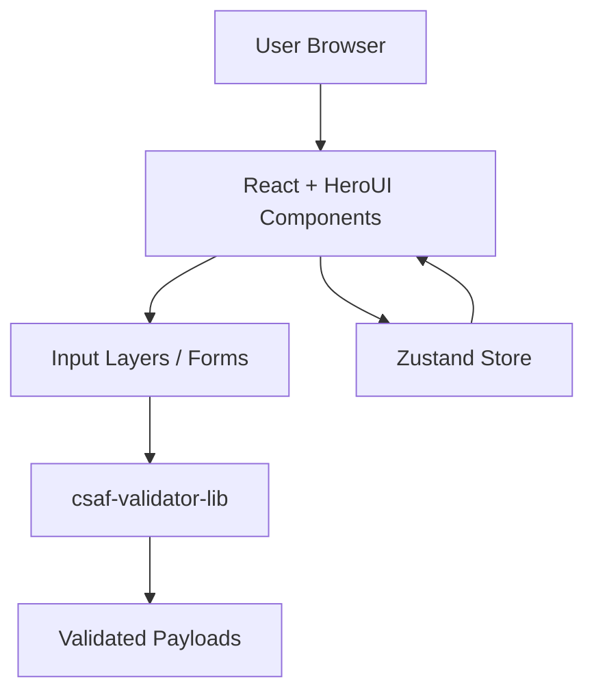

# Sec-O-Simple

<!-- TOC depthfrom:2 depthto:3 -->
- [Sec-O-Simple](#sec-o-simple)
- [Introduction](#introduction)
- [Getting started](#getting-started)
  - [Prerequisites](#prerequisites)
  - [Clone & Setup](#clone--setup)
  - [Configuration](#configuration)
  - [Running Locally](#running-locally)
  - [Building for Production](#building-for-production)
- [Developing](#developing)
  - [Local Development Setup](#local-development-setup)
  - [Branching & Pull Request Policy](#branching--pull-request-policy)
- [Developer Guide, Architecture and Technical Design](#developer-guide-architecture-and-technical-design)
  - [Code & Module Organization](#code--module-organization)
- [Security Considerations](#security-considerations)
  - [Input Validation](#input-validation)
  - [Invalid Document Export](#invalid-document-export)
- [Contributing](#contributing)
- [Dependencies](#dependencies)
- [Configuration Summary](#configuration-summary)
- [Breakdown / References](#breakdown--references)
- [License](#license)
<!-- /TOC -->

## Introduction

_Placeholder for BSI Description_

## Getting started

These instructions explain what a user must do to obtain, configure, and run the tool.

### Prerequisites

- **Git** – to clone the repository.  
- **Node.js** 20 or higher (LTS recommended).  
- **NPM** (comes bundled with Node.js).  
- Recommended: modern browser (e.g., Chromium-based or Firefox).  

### Clone & Setup

```sh
git clone git@github.com:sec-o-simple/sec-o-simple.git
cd sec-o-simple
npm install
```

### Configuration

Further information about the configuration can be found in the [Configuration](./docs/CONFIG.md)

### Running Locally

```sh
npm run dev
```

By default, the webapp is accessible at: [http://localhost:8080](http://localhost:8080)

Optional helpful commands:

```sh
npm run lint      # run linting (if configured)
npm run lint:fix  # fix linting issues
npm run format    # format code (if configured)
npm test          # run automated tests
```

### Building for Production

```sh
npm run build
npm run preview
```

Built artifacts are output to the production directory (e.g., `dist`). Preview locally with the provided script.

## Developing

This section describes how developers contribute and work on the codebase.

### Local Development Setup

1. Clone and install dependencies:
   ```sh
   git clone git@github.com:sec-o-simple/sec-o-simple.git
   cd sec-o-simple
   npm install
   ```

2. Start development server:
   ```sh
   npm run dev
   ```

3. Run quality and test checks before committing:
   ```sh
   npm test
   npm run lint
   npm run format
   ```

### Branching & Pull Request Policy

When working on new features or fixing bugs, create a new branch based on main
and give it a meaningful name. Rebase or merge main regularly into your branch
in order to prevent large merge conflicts.

- Base all work off of the `main` branch.  
- Use descriptive branch names:  
  - Features: `feat/<description>` (e.g., `feat/navigation-redesign`)  
  - Fixes: `fix/<description>` (e.g., `fix/excessive-loading-time`)  
- Rebase or merge `main` frequently to avoid large conflicts.  
- Pull requests must follow the [Template](https://raw.githubusercontent.com/sec-o-simple/sec-o-simple/refs/heads/main/.github/pull_request_template.md)

- Commit messages should be clear and imperative.  

## Architecture Overview

A frontend-only application built with **React.js**, styled with **Tailwind CSS**, and composed via **HeroUI**. Local state is managed with **Zustand** where appropriate, and all external input is validated through the **csaf-validator-lib**.

### Tech Stack

- **UI / Presentation:**  
  - React.js  
  - Tailwind CSS  
  - HeroUI (design system / component library)  

- **State Management:**  
  - Zustand — lightweight, composable global/local state store

- **Validation:**  
  - `csaf-validator-lib` — used for validating input 

### High-Level Architecture

_Install Mermaid-Extension for this architecture_


## Developer Guide

### Code & Module Organization

- `src/` — application source code (components, services, utilities).  
- `tests/` — automated test suites (unit/integration).  
- `./docs/` — supplemental documentation (schema, config, well-known).  
- `package.json` / `package-lock.json` — scripts and dependency management.

## Security Considerations

### Input Validation

The form is validated using the rules of ```csaf-validator-lib```.

### Invalid Document Export

In sec-o-simple the document can be exported at any point, if the document is invalid at this point a suffix of ```_invalid``` is appended.

## Contributing

Please refer to this [document](CONTRIBUTING.md).

Key guidelines:

- Fork or branch off `main`.  
- Use descriptive branch names (`feat/...`, `fix/...`).  
- Ensure linting and automated tests pass before submitting.  
- Open a pull request using the template
- Address reviewer feedback promptly

## Dependencies

Primary dependencies are declared in `package.json`. 

Highlights include:

- **Node.js 20+** — runtime environment  
- **Vite** — build and development tooling  
- **HeroUI** and **Tailwind CSS** — UI component framework and utility-first styling
- **ESLint / Prettier** — code quality enforcement  
- **Testing frameworks** — for unit/integration testing  

Run the following to surface known vulnerabilities:

```sh
npm audit
```

The lockfile (`package-lock.json`) ensures repeatable installs.

## Configuration Summary

For project-specific configuration refer to `./docs/configuration.md`.

## Breakdown / References

- `./docs/` — extended documentation (architecture, security, usage, etc.)  
- `./CONTRIBUTING.md` — contribution guidelines  
- `./.github/` — CI workflows, issue/PR templates  
- `./src/` — source code  
- `./locales/` — translation files for english and german
- `./tests/` — automated test suites  

## License

This project is licensed under the [Apache License](./LICENSE).  

## Dependencies

Regarding dependencies please refer to [this](DEPENDENCIES.md).